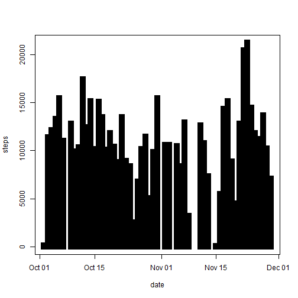
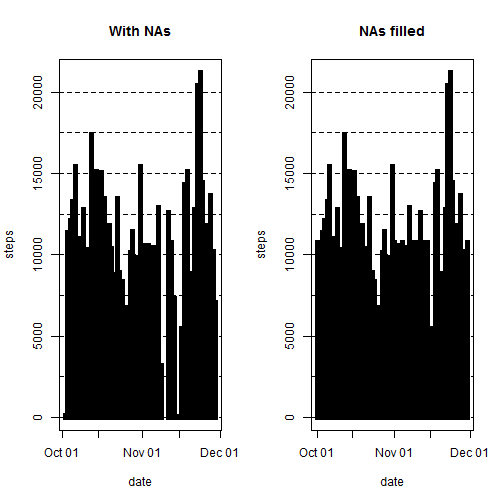
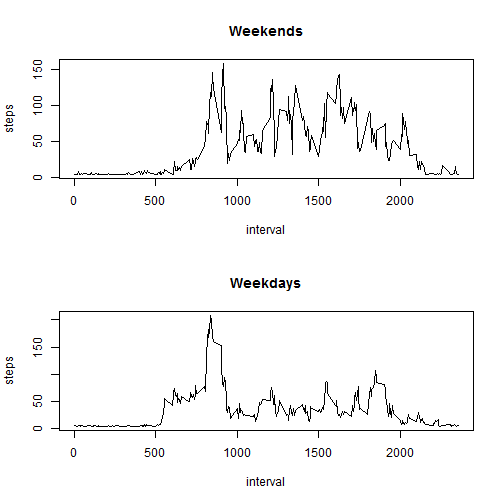

```r
echo = TRUE  # The code is displayed
```


## 1. Loading and preprocessing the data

### 1.1. Unzip and read the data  from the GitHub repository. Dimensional exploration.


```r
activity <- read.csv(unz("activity.zip", "activity.csv"))
sapply(activity, class)
```

```
##     steps      date  interval 
## "integer"  "factor" "integer"
```

### 1.2. Process/transform the data (if necessary) into a format suitable for your analysis.

activity$date is converted from factor to date class. I used the "zoo" package to manage the time serie which, furthermore, is regularly spaced. The data are collected on 61 days.


```r
activity$date <- as.Date(activity$date, format = "%Y-%m-%d")
suppressWarnings(library(zoo))
```

```
## 
## Attaching package: 'zoo'
## 
## The following objects are masked from 'package:base':
## 
##     as.Date, as.Date.numeric
```

```r
is.regular(activity$date)
unique(activity$date)
```


## 2. What is mean total number of steps taken per day?

### 2.1 Calculate the total number of steps taken per day

The result is calculated and stored in the object "steps_day". Missing values are removed. Since the resulting table is quinte large, I set {r, results = "hide"}. Approximately the 13% of cases in "steps" result in missing data.


```r
colMeans(is.na(activity))
steps_day <- aggregate(steps ~ date, rm.na = TRUE, data = activity, FUN = sum)
```

### 2.2. Make a histogram of the total number of steps taken each day
Missing gvalues are not omitted in this plot.


```r
plot(steps_day, type = "h", lwd = 10, lend = "square")
```

 

### 2.3. Calculate and report the mean and median of the total number of steps taken per day.

Since those calculations return two large tables the results are not shown.


```r
aggregate(steps ~ date, data = activity, FUN = mean)
aggregate(steps ~ date, data = activity, FUN = median)
```

## 3. What is the average daily activity pattern?

### 3.1. Make a time series plot (i.e. type = "l") of the 5-minute interval (x-axis) and the average number of steps taken, averaged across all days (y-axis)


```r
plot(aggregate(steps ~ interval, data = activity, FUN = mean), type = "l")
```

 

### 3.2. Which 5-minute interval, on average across all the days in the dataset, contains the maximum number of steps?

The base function max() should rapidly give us the answer.


```r
max(activity$steps, na.rm = TRUE)
```

```
## [1] 806
```

## 4. Imputing missing values

Note that there are a number of days/intervals where there are missing values (coded as NA). The presence of missing days may introduce bias into some calculations or summaries of the data.

### 4.1. Calculate and report the total number of missing values in the dataset (i.e. the total number of rows with NAs)


```r
sum(is.na(activity))
```

```
## [1] 2304
```

### 4.2. Devise a strategy for filling in all of the missing values in the dataset. The strategy does not need to be sophisticated. For example, you could use the mean/median for that day, or the mean for that 5-minute interval, etc.

I am going to substitute each NA with a fixed value. I set the fixed value equivalent to the overall mean of the variable activity$steps.


### 4.3. Create a new dataset that is equal to the original dataset but with the missing data filled in.


```r
activity2 <- activity
sapply(activity2, class)
```

```
##     steps      date  interval 
## "integer"    "Date" "integer"
```

```r
activity2$steps[is.na(activity2$steps)] <- mean(na.omit(activity$steps))
activity2$date <- as.Date(activity2$date, format = "%Y-%m-%d")
```

### 4.4. Make a histogram of the total number of steps taken each day and Calculate and report the mean and median total number of steps taken per day. Do these values differ from the estimates from the first part of the assignment? What is the impact of imputing missing data on the estimates of the total daily number of steps?


```r
steps_day2 <- aggregate(steps ~ date, rm.na = TRUE, data = activity2, FUN = sum)

par(mfrow = c(1, 2))
plot(steps_day, type = "h", lwd = 5,lend = "square", main = "With NAs")
abline(h = seq(0, 20000, 2500), lty = "dashed")
plot(steps_day2, type = "h", lwd = 5, lend = "square", main = "NAs filled")
abline(h = seq(0, 20000, 2500), lty = "dashed")
```

 

```r
dev.off()
```

```
## null device 
##           1
```

Filling the NA makes the distribution more homogeneous. By the way, this operation could hide interesting patterns such as the inactivity during particular days of the week.


```r
aggregate(steps ~ date, data = activity, FUN = mean)
aggregate(steps ~ date, data = activity, FUN = median)
aggregate(steps ~ date, data = activity2, FUN = mean)
aggregate(steps ~ date, data = activity2, FUN = median)
```

The results, that I do not report because of the length, suggest that the strategy adopted to fill the missing values could be not adeguated. Indeed, new biases patterns evidently appear in the calculation operated on the activity2 dataset.

## 5. Are there differences in activity patterns between weekdays and weekends?

For this part the weekdays() function may be of some help here. Use the dataset with the filled-in missing values for this part.

### 5.1. Create a new factor variable in the dataset with two levels – “weekday” and “weekend” indicating whether a given date is a weekday or weekend day.


```r
activity2$weekday <- factor(format(activity2$date, "%A"))

levels(activity2$weekday) <- list(weekday = c("Monday", "Tuesday",
                                              "Wednesday", "Thursday",
                                              "Friday"), weekend =
                                          c("Saturday", "Sunday"))
```


### 5.2. Make a panel plot containing a time series plot (i.e. type = "l") of the 5-minute interval (x-axis) and the average number of steps taken, averaged across all weekday days or weekend days (y-axis). See the README file in the GitHub repository to see an example of what this plot should look like using simulated data.


```r
par(mfrow = c(2, 1))

with(activity2[activity2$weekday == "weekend",], plot(aggregate(steps ~ interval, FUN = mean), type = "l", main = "Weekends"))

with(activity2[activity2$weekday == "weekday",], plot(aggregate(steps ~ interval, FUN = mean), type = "l", main = "Weekdays"))
```

 

```r
dev.off()
```

```
## null device 
##           1
```


